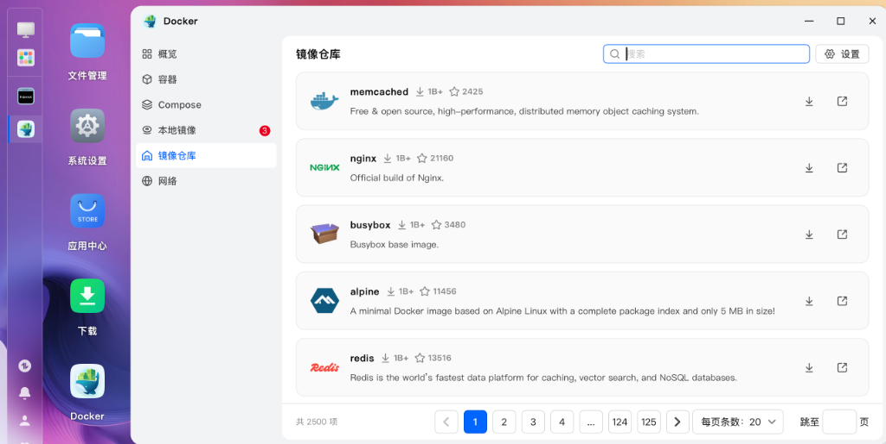
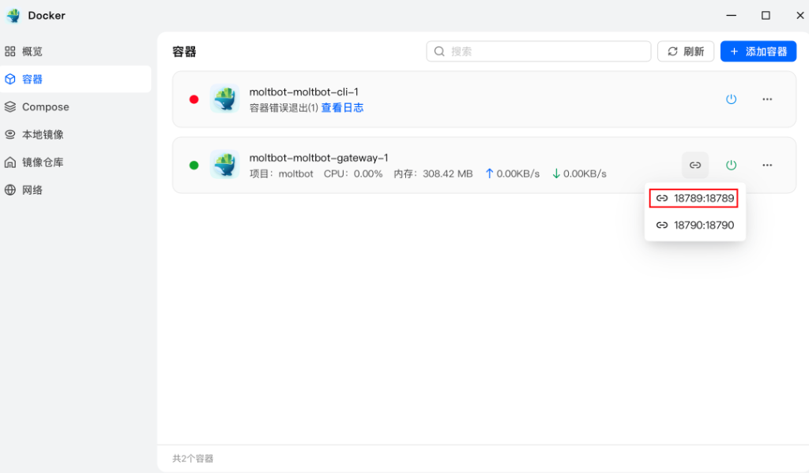
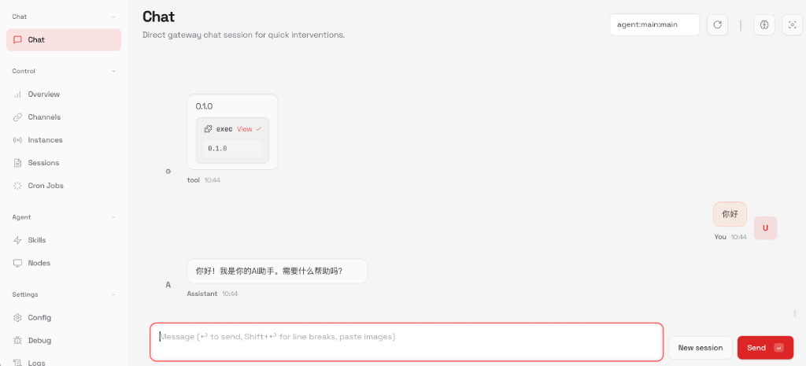

# 飞牛 NAS (fnOS) 部署 Moltbot 完整实战指南 (2026版)
> **版本说明**：本指南综合了 **Moltbot 官方文档** 与 **飞牛 NAS (fnOS)** 的网络环境特性，提供了"一键自动化"和"手动分步"两种部署方案。

---

## 🔌 消息平台集成

Moltbot 支持多种消息平台。本仓库提供**两个部署脚本**供您选择：

| 脚本 | 说明 | 适用场景 |
|------|------|---------|
| `deploy.sh` | 标准版（不含消息平台插件） | 仅需要 Moltbot 核心功能，或使用官方支持的平台 |
| `deploy_with_feishu.sh` | 飞书版（自动安装飞书插件） | 需要在国内使用飞书接入 Moltbot |

### 飞书 (Feishu) - 社区插件

使用社区开发的 `moltbot-feishu` 插件（⚠️ 非官方，需谨慎测试）

**特点**：
- ✅ 国内可用，无需特殊网络
- ✅ 长连接模式，无需公网 IP
- ✅ 支持私聊和群聊
- ⚠️ 社区维护，可能存在兼容性问题

**安装方式**：
- **自动安装**（推荐）: 使用 `deploy_with_feishu.sh` 脚本自动部署
- **手动安装**: 参见 [moltbot_feishu_int.md](moltbot_feishu_int.md)

**适用场景**：国内企业用户，需要在飞牛 NAS 上本地部署 AI 助手

**快速开始**：
```bash
# 使用飞书版部署脚本（自动安装飞书插件）
sudo ./deploy_with_feishu.sh
```

### 其他平台

Moltbot 官方支持的平台包括：
- **Telegram** (需要网络代理)
- **WhatsApp** (需要网络代理)
- **Slack, Discord** 等（主要面向海外用户）
- **iMessage** (仅支持 macOS，NAS 环境不可用)

详见 [Moltbot 官方文档](https://docs.molt.bot/channels)

**注意**：钉钉 (DingTalk) 目前官方不支持，阿里云方案需要使用其专有基础设施。

---

## 🚀 极速部署 (Quick Start) - 推荐方案

本仓库提供**两个自动化部署脚本**（v2.3），根据您的需求选择：

### 📦 方案选择

#### 🔷 标准版部署（推荐新手）
适用于仅需要 Moltbot 核心功能的用户，不预装任何消息平台插件。

```bash
sudo ./deploy.sh
```

**特点**：
- ✅ 轻量级，仅包含必要组件
- ✅ 可后续手动添加任何平台插件
- ✅ 适合先体验 Moltbot，再决定接入哪个平台

#### 🔷 飞书版部署（国内企业用户）
自动安装飞书社区插件，适用于需要在国内通过飞书使用 Moltbot 的用户。

```bash
sudo ./deploy_with_feishu.sh
```

**特点**：
- ✅ 自动安装 `moltbot-feishu` 插件
- ✅ 长连接模式，无需公网 IP
- ⚠️ 社区插件，非官方支持

---

### 📥 下载与安装

**使用方法**：

1.  **下载脚本**：
    *   **方法 A (Git Clone 推荐)**:
        ```bash
        # 将本仓库拉取到 NAS 任意目录
        git clone https://github.com/YourName/FNNAS_moltbot.git
        cd FNNAS_moltbot
        ```
    *   **方法 B (直接下载)**:
        在 GitHub 文件列表中点击 `deploy.sh` -> 下载并上传到 NAS。

2.  **执行安装**：

    **标准版**（不含飞书）：
    ```bash
    chmod +x deploy.sh
    sudo ./deploy.sh
    ```

    **飞书版**（含飞书插件）：
    ```bash
    chmod +x deploy_with_feishu.sh
    sudo ./deploy_with_feishu.sh
    ```

    *(注意：脚本会自动检查并拉取 Moltbot 源码到 `/vol1/moltbot`，请确保您有 sudo 权限)*

**两个脚本的共同功能**：
*   ✅ **自动拉取**：自动 clone 官方源码
*   ✅ **自动适配**：修正 Dockerfile 适配 `node:25.5.0-bookworm`
*   ✅ **一键修复**：自动解决 Skills 无法加载、挂载丢失等问题
*   ✅ **防呆校验**：包含权限检查和镜像存在性校验
*   ✅ **基础技能**：自动安装 tavily、github、summarize、weather

**飞书版额外功能**：
*   🆕 **飞书插件**：自动安装 `moltbot-feishu` 社区插件
*   🆕 **配置提示**：部署完成后提供飞书配置指引

---

## 📋 完整手动流程 (Manual Guide)

如果您希望了解部署细节，或者脚本执行遇到问题，请参考以下手动步骤。

### 📅 第一步：下载源码 (Get Code)
请通过 SSH 连接您的 NAS 终端。

**路径建议**：`/vol1/moltbot` (直接在存储卷根目录，数据安全且易于管理)

```bash
# 1. 进入存储卷根目录
cd /vol1

# 2. 拉取代码
git clone https://github.com/moltbot/moltbot.git

# 3. 进入项目目录 (后续所有命令都在这里执行)
cd moltbot
```

---

### 🖼️ 第二步：手动拉取基础镜像 (UI Pull Strategy)
**⚠️ 关键点**：由于国内 Docker Hub 访问受限，请**不要**尝试在命令行直接 pull，而是利用飞牛 NAS 自带加速的 Web 界面。



**操作步骤 (Standard Procedure)**：

1.  **Node.js (核心环境)**:
    Nas桌面进入Docker -> 镜像仓库 -> 搜索 `node` 下载前选择相应的镜像标签 (推荐 **`25.5.0-bookworm`**)

2.  **数据库 (PostgreSQL)**:
    Nas桌面进入Docker -> 镜像仓库 -> 搜索 `postgres` 下载前选择相应的镜像标签 (推荐 `15-alpine`)

3.  **缓存 (Redis)**:
    Nas桌面进入Docker -> 镜像仓库 -> 搜索 `redis` 下载前选择相应的镜像标签 (推荐 `7-alpine`)

**确认**：等待左侧 "本地镜像" 列表中出现这三个绿色的镜像。

---

### 🛠️ 第三步：修改配置 (Configuration)

#### 3.1 修改 Dockerfile (指定基础镜像)
由于 Moltbot 默认使用 `node:22-bookworm`，而我们本地下载的是 **`node:25.5.0-bookworm`**，必须修改 Dockerfile 以精确匹配本地镜像，避免 Docker 尝试联网重新拉取。

```bash
vi Dockerfile
```
**修改动作**：
将文件开头的 `FROM` 语句改为您下载的确切版本：
`FROM node:25.5.0-bookworm`

同时，找到 `ENV PATH` 附近，注入 corepack 修复：
```dockerfile
# ...
ENV PATH="/root/.bun/bin:${PATH}"
# [新增] 加上 --force 以覆盖冲突文件
RUN npm install -g corepack --force
RUN corepack enable
# ...
```

#### 3.2 系统配置文件 (.env)
**⚠️ 官方规范**：`.env` 文件仅用于配置**系统级参数**。AI 模型的 Key 请在网页里配。

```bash
cp .env.example .env
vi .env
```
配置端口和数据持久化路径：
```env
PORT=3000
CLAWDBOT_CONFIG_DIR=./data
CLAWDBOT_WORKSPACE_DIR=./workspace
```

#### 3.3 修改 docker-compose.yml (核心修正)
**这是 NAS 部署成败的关键**。请务必修改 `volumes` 挂载，否则技能无法加载。

**Gateway 服务**：
```yaml
environment:
  CLAWDBOT_SKILLS_DIR: /app/skills  # [新增]
volumes:
  - ./skills:/app/skills            # [新增]
```
**CLI 服务**：
```yaml
volumes:
  - ./skills:/app/skills            # [新增]
```

---

### 🚀 第四步：部署与初始化 (Manual Build & Onboard)

#### 4.1 手动编译镜像
```bash
sudo docker build -t moltbot:local .
```

#### 4.2 初始化与生成 Token
```bash
sudo docker compose --env-file .env run --rm moltbot-cli onboard
```
*   **注意**：请务必**复制**屏幕最后显示的 **Gateway Token**。

#### 4.3 启动服务
```bash
sudo docker compose up -d
```

---

### 🌐 第五步：访问策略 (Access Strategy)

#### 5.1 内网访问
访问 `http://[NAS_IP]:18789/?token=您的Token`。
如果遇到 1008 报错，请在 `moltbot.json` 中添加 `controlUi: { allowInsecureAuth: true }`。

#### 5.2 外网访问 (fnConnect)
利用飞牛 NAS 自带的穿透功能。



1.  在 Docker 管理器中点击 Moltbot Gateway 的链接图标。
2.  **关键**：在打开的网址后面手动加上 `?token=您的Token`。

---

### ✅ 第六步：功能验证 (Verification)

1.  **检查健康状态**：网页右上角显示 **🟢 Health: Online**。
2.  **测试 AI 对话**：发送 `Hello`，确认回复正常。



---

## 📝 附录一：Onboard 日志解析
*   **Gateway Token**：登录凭证。
*   **Health check failed**：CLI 连不上 Gateway 是正常的，可忽略。

## 📝 附录二：如何修改 AI 模型
目前需修改 `/vol1/moltbot/data/moltbot.json` 并在 `.env` 中添加 API Key。

## 📝 附录三：如何开启联网搜索 (Tavily)
推荐使用 Tavily (免费且无需信用卡)。
在 `.env` 中添加：
```bash
TAVILY_API_KEY=tvly-xxxxxxxx
```
然后重启容器。

## 📝 附录四：如何升级 Moltbot
推荐流程：`git stash` -> `git pull` -> `git stash pop` -> `docker build` -> `docker compose up -d`。